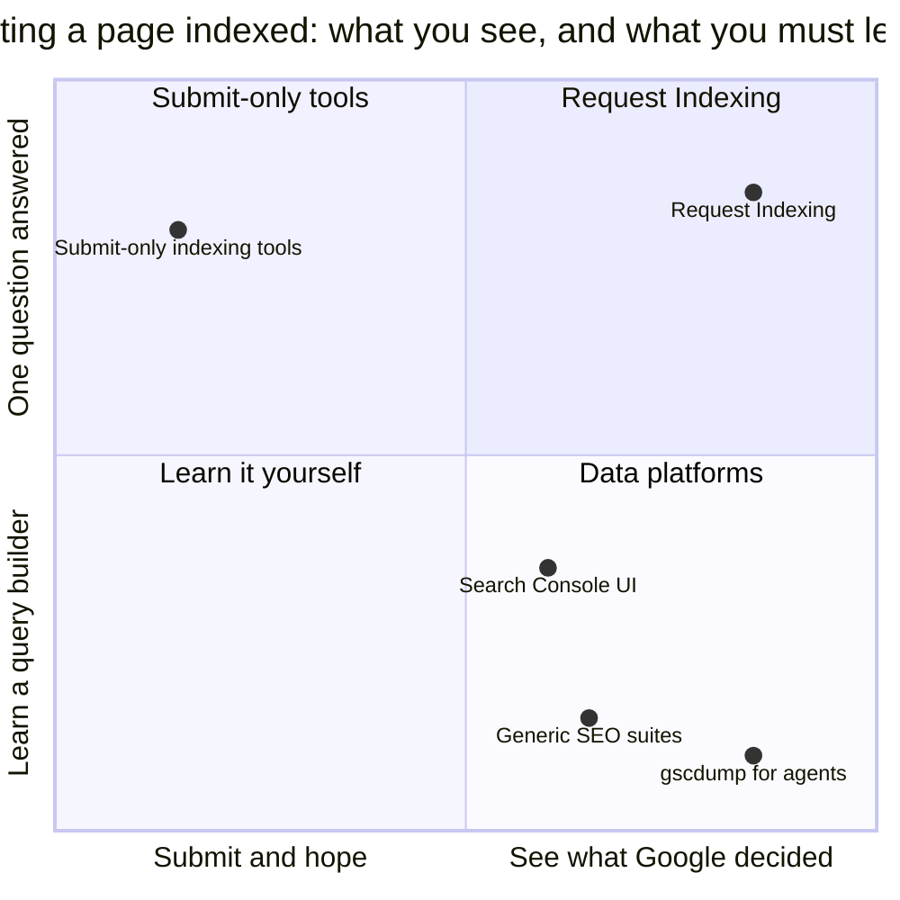

# Marketing

Godin's definition: marketing is the generous act of helping someone make a change they already want. It starts with the person, never the product.
This file answers his questions for Request Indexing, so any page, post, email, or channel can be checked against them.

## The change we seek to make

Today, a person publishes a page, asks Google to index it, and waits. Nothing tells them whether it worked, or why not. After Request Indexing, they see whether Google indexed each page, the reason Google gives when it did not, and what changed since last week.

- **From** "I submitted it, so it is done" **to** "a Submission is a notification, and I can see what Google decided."
- **From** guessing why a page is missing **to** reading the reason Google gives for that URL.
- **From** learning another dashboard **to** one question answered: is this page indexed, and if not, why?

**Test:** does this piece move someone along one of these lines? If not, cut it.

## Who it is for

VISION names the person: someone who published a page and wants it found. In practice: indie devs, small agencies, and operators running a handful of Sites who do not want another dashboard with a query builder in it.

**The smallest viable audience is the indie developer whose new page is missing from Google.**
They typed "request indexing" into Google. They want an answer and the next step, not a course in SEO.

**Worldview.** They believe:
- Google decides what it indexes. A tool that promises otherwise is not telling the truth.
- A status without its reason is not an answer.
- Free and open source is a reason to try something.
- Another dashboard is a cost.

**People like us** ship the page, check that Google has it, and fix what stops it.

**Not for**, and marketing never chases them. Godin: saying so is a kindness, and a signal to the people it is for.

- **The agent operator.** gscdump serves them directly, through MCP. Request Indexing never leads with agents. The Developers page and one onboarding email serve people who already use a coding agent.
- **The growth team**, which nuxtseo Pro serves, and **the platform buyer** who wants AI visibility, rank tracking, or a generic SEO platform.
- **The guarantee buyer** who wants guaranteed or instant indexing, or a black-hat shortcut. VISION rejects both.

## The marketing promise

> Request Indexing is for people who published a page and want to know whether Google indexed it.
> It focuses on people who want the answer and its reason without learning a query language.
> It promises the record: what you submitted, what Google decided, and what changed.

Every surface is a smaller version of this promise. It never promises indexing. Engines decide outcomes (VISION).

## Positioning: the empty corner

- **Axis 1, after the submit button:** nothing, or the record of what Google decided.
- **Axis 2, what the person must learn:** reports and a query builder, or one question with its answer.

VISION describes the category: submission-only tools that ping engines from a landing page with no observability behind them. They show nothing after the click.
Search Console, SEO suites, and gscdump hold the evidence behind reports or a query language. Request Indexing holds the corner where both are true.

**Rejects:**
- **One-axis campaigns.** "Faster indexing" or "more engines" is the submit-only tools' race. "More data" is the SEO suites' race, and VISION calls matching Ahrefs a treadmill.
- **Multi-engine claims** before the gscdump protocol ships them (COPY.md truth rules).

## Tension, used honestly

The tension is the search itself: a page you published is not in Google, and you do not know why. It is true for everyone who arrives. It releases when the person reads the reason Google gives.

**Rules:**
- A Submission is a notification Google accepted, never proof of indexing. Copy that blurs the two invents both the tension and the release.
- No indexing timeframe. The landing H1's 48 hours has no evidence row. COPY.md open question 1 owns that decision, and no other surface repeats the number.
- The Google Indexing API covers job posting and livestream pages only. Never imply a wrapper extends it to ordinary pages (`apps/marketing/content/COPY.md`).
- No countdowns or scarcity. The product is free, and that is the whole offer.

## Status and affiliation

The audience seeks affiliation: being a developer who ships and does it properly, with tools they can check. Harlan maintains Nuxt SEO. The code is MIT and public. Both signal the group.

**Rejects:** "beat your competitors", "rank #1", "instant indexing", and growth-hack copy. They sell dominance, and some sell a guarantee nobody can keep.

## Permission and trust, earned in this order

1. **Free tools first.** The `/tools` pages check index status with no signup. The first interaction is a gift.
2. **Guides that tell the truth.** They say what the Indexing API covers and what an accepted notification proves. A reader leaves knowing more, even without signing up.
3. **The record keeps its promise.** A wrong or stale reason breaks trust faster than any page builds it.
4. **Email with one useful step.** Account emails send when something changed, such as the Free allowance. The three onboarding emails each stand alone with one action, and one unsubscribe stops all of them. No email exists only to remind.

**Trust comes from what a skeptic can check:** the MIT source, the truth rules in COPY.md, and claims that name their evidence.

## Pricing is a story

- **Free, with a Free allowance** says: try it on your own Sites with no sales call (VISION).
- **gscdump sets the allowance.** The app reads the numbers at runtime, so marketing never hardcodes them (COPY.md truth rules).
- **Paid usage comes later**, under this brand (VISION). Marketing never quotes a price before one exists.

## Channels, ranked by permission

*This Is Strategy*: choose the game, then let the system work over time. Our game is to be the best answer to the search "request indexing", the name VISION took from that search.

| Channel | Why it fits |
|---|---|
| Search for "request indexing" and its questions | The audience types the product name when they need it |
| Free `/tools` pages | An answer before signup |
| Guides and comparisons | Trust, earned by saying what the API cannot do |
| Harlan's channels | A maintainer the audience already follows |
| The open-source repository | The code is the evidence |
| nuxtseo.com and gscdump.com | People already in the family, sent where their job fits |

**Rejects:** paid ads before people return, cold outreach, "instant indexing" listicles, link schemes, and any forum that sells indexing tricks.

## The review gate

Before any page, post, launch, or email ships, answer each question in one line:

1. **Who is it for?** Name the audience from this file.
2. **What change does it move?** Name the line from "The change we seek to make".
3. **Does it fit the promise?** It never promises indexing.
4. **Is the tension true?** Point to VISION.md or the truth rules in COPY.md.
5. **What is the one action?** Exactly one, and it happens inside Request Indexing.

If any answer is blank, it does not ship.

## Voice

Founder-led. Harlan writes in first person on his own channels and in the onboarding emails: plain, specific, a little dry, with no marketing gloss.
Product surfaces follow the registers in COPY.md. Every claim names its number or its source.

**Rejects:** a faceless brand voice, superlatives, and any claim without its evidence.

## Open questions

Decisions this file cannot settle yet. Resolve one, fold it in above, then delete it here.

1. **Submission for ordinary pages.** The landing meta description offers Indexing API requests for "your pages", and the API covers job posting and livestream pages only. Decide whether marketing leads with Submission, or with the record.
2. **Founder rhythm.** Which of Harlan's channels carries Request Indexing, and how often.
